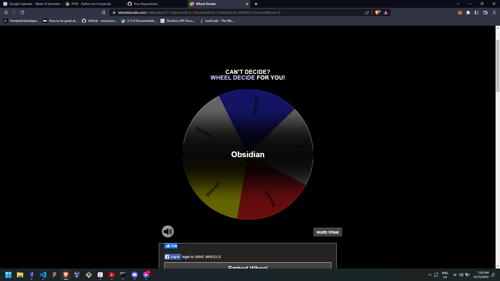

# The Science of Obsidian

## Description
"The Science of Obsidian" is my personal project to practice my skills in HTML, CSS, and JavaScript. This is a website that mainly talks about [Obsidian](https://obsidian.md/), a personal knowledge management app.

## Background
The whole idea of this project was only to create a website of any content that will allow me to practice the foundations of web development. At first, I had no idea on the content that I will use so I just listed, on top of my head, 5 things that I am excited or passionate about. And apparently, all of them were apps.

They were:
1. Valorant
2. Obsidian
3. ClickUp
4. JIRA
5. Discord

Since I could not decide on what to use, I had the [wheel decide](https://wheeldecide.com) it for me. Below is the screenshot of what I got:

And with that, my website is now actually just a _fansite_ of Obsidian.

## Stages
This project is broken down into three stages of development. First is building the overall structure and content of the website, which means that the first stage would be writing HTML only. Next is styling the built website to add some "_flavor_" to it using CSS, and finally, add some interaction and behavior using JavaScript.

### HTML Only
#### Objective
- Build a website with several webpages using HTML only.
- Master HTML elements.
- Write semantic HTML.
- Build a website that is accessible, i.e. follows the accessibility guidelines.

For this stage of the project, I would like to master the HTML as a whole, and properly lay out the structure of the website to be styled and manipulated later on.

### HTML and CSS
#### Objective
- Style the website with different layouts.
- Master the use of `class` and `id` attributes to create and group styles efficiently.
- Create styles that are accessible, i.e. follows the accessibility guidelines.

For this stage of the project, I would like to master CSS and create different layouts depending on the use case. The website will have different versions of styling, and will later on be used in the third stage where these different layouts can be toggled on and off.

### HTML, CSS, and JavaScript
#### Objective
- Transform a static website into a dynamic one.
- Understand the Document Object Model (DOM).
- Create interactions for different use cases, i.e. submitting a feedback, purchasing an item, etc.

Finally, master JavaScript to create a fully functioning website that users can interact with.

## Roadmap
The timeline for this project is based on soon I can finish learning these languages. As of writing, I am still studying JavaScript using [The Odin Project](https://theodinproject.com) curriculum.

## Releases
### v1.0.0
This release covers the HTML stage of the project. All succeeding versions under v1.0.0 are either fixes or improvements on the current stage of the project.

### v2.0.0
This release will cover the second stage of the project&mdash;HTML, and CSS. Just like with the first version, all succeeding releases under this version will be fixes and/or improvements.

### v3.0.0
This will be the final release version where the website should already be a fully-functional dynamic website.

## Feedback
If you have any concerns, suggestions, or feedback about this project, please feel free to reach out to me in the following platforms:
- [Discord](https://discordapp.com/users/458916484849336320)
- [Twitter](https://twitter.com/nldgutierrez)

## Disclaimer
All content in this website are not mine. They have been collated from different sources such as the official Obsidian website, blogs about Obsidian, etc. The sources are listed in the [References](https://nldgutierrez.github.io/tsoo-html/references.html) page of the website.